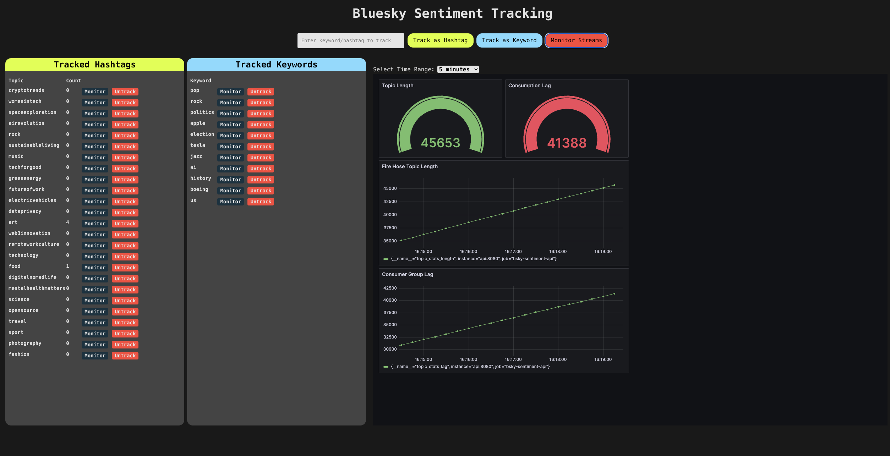

# Bluesky Sentiment Analysis with Redis Streams Java

This sample shows you how to use Redis Streams Java to scale out consumption on a Redis Stream.

## What it does

This demo listens to the the Bluesky firehose, parses the messages that come from posts, and posts them to a Redis Stream. Then a scalable group of consumers consumes the
stream, runs sentiment analysis on it, and then posts the analyzed docs to Redis. In the background the API service controls which hashtags and keywords are monitored,
as well as periodically aggregating sentiment and posting those aggregated sentiments to prometheus, you can then check in on the sentiments for a given keyword or hashtag
in the frontend with Grafana.

## How to run this demo

### Locally

You can run the demo locally using docker by running:

```
./gradlew build
docker compose build
docker compose up
```

Running that script will build the project for you and spin up the containers necessary to run it - you can then check out the project by going to `http://localhost` in your browser



You'll see above the lag has grown quite a lot! that's because it's only running one consumer while trying to analyze the sentiments of the all of english language Bluesky. You may want to use more consumers.

### Running with more consumers remotely

If you'd like to try running with more consumers remotely, there are terraform scripts for both gcp and aws, to use them simply cd to your respective directory and, create your `.tfvars` file by running `mv .tfvars.example .tfvars` and filling in your values. Then run the following:

```
terraform init
terraform plan -var-file='.tfvars'
terraform apply -var-file='.tfvars' --auto-approve
```
